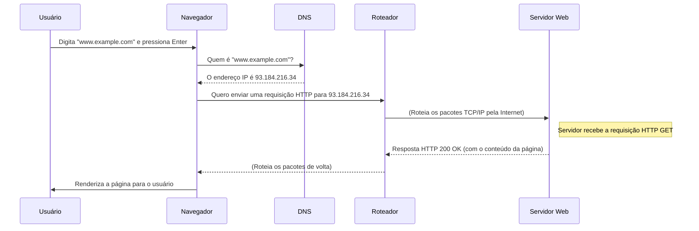

# 🌐 Redes de Computadores: Conectando o Mundo Digital

**Redes de Computadores** são um conjunto de dois ou mais dispositivos (como computadores, servidores, celulares e impressoras) interconectados com o objetivo de compartilhar recursos, trocar dados e permitir a comunicação. Em sua essência, as redes são a infraestrutura que possibilita a existência da internet, dos e-mails, dos serviços de streaming e de praticamente toda a tecnologia digital que usamos hoje.

Pense em uma rede como o sistema postal de um país:

  - Os **dispositivos** são as casas e empresas.
  - Os **dados** são as cartas e pacotes.
  - Os **meios de transmissão** (cabos, fibra óptica, Wi-Fi) são as estradas e rotas aéreas.
  - Os **protocolos** são as regras (como o formato do endereço e o CEP) que garantem que as cartas cheguem ao destino correto.

As redes podem variar em escala, desde uma **LAN (Local Area Network)** em sua casa ou escritório, até uma **WAN (Wide Area Network)**, como a própria Internet, que conecta bilhões de dispositivos em todo o mundo.

-----

## 📜 Os Modelos de Camadas: OSI e TCP/IP

A comunicação em rede é um processo extremamente complexo. Para gerenciá-lo, foram criados modelos de referência que dividem a comunicação em **camadas**. Cada camada tem uma função específica e só se comunica com as camadas adjacentes (a de cima e a de baixo). Isso simplifica o design e a solução de problemas.

  - **Modelo OSI (Open Systems Interconnection)**: Um modelo teórico e acadêmico com 7 camadas. É ótimo para entender os conceitos, mas não é usado na prática.
  - **Modelo TCP/IP**: O modelo prático de 4 camadas no qual a internet moderna foi construída.

**As 4 Camadas do Modelo TCP/IP:**

1.  **Camada de Aplicação (Application Layer)**: Onde as aplicações do usuário interagem com a rede. É aqui que vivem protocolos como **HTTP** (para a web), **DNS** (resolução de nomes), **SMTP** (e-mail) e **FTP** (transferência de arquivos).
2.  **Camada de Transporte (Transport Layer)**: Garante a entrega dos dados entre os processos em diferentes hosts. Os dois principais protocolos são:
      - **TCP (Transmission Control Protocol)**: Confiável e orientado à conexão (garante que todos os pacotes cheguem na ordem correta).
      - **UDP (User Datagram Protocol)**: Rápido e não orientado à conexão (não garante a entrega, mas é ótimo para streaming e jogos).
3.  **Camada de Rede/Internet (Network/Internet Layer)**: Responsável pelo endereçamento lógico e pelo roteamento dos pacotes de dados através da rede. O protocolo principal aqui é o **IP (Internet Protocol)**.
4.  **Camada de Enlace/Física (Link/Physical Layer)**: Lida com a transmissão física dos bits (0s e 1s) através do meio físico (cabos Ethernet, Wi-Fi, fibra óptica).

-----

## 🛠️ Componentes e Protocolos Essenciais

  - **Endereço IP (IP Address)**: O "endereço" lógico e único que identifica um dispositivo em uma rede. Exemplo: `192.168.1.101`.
  - **Roteador (Router)**: O "agente de trânsito" da internet. Sua função é conectar redes diferentes e encaminhar os pacotes de dados entre elas, escolhendo a melhor rota para o destino.
  - **Switch**: Um dispositivo que conecta vários equipamentos dentro de uma mesma rede local (LAN), direcionando o tráfego de forma inteligente apenas para o dispositivo de destino correto.
  - **DNS (Domain Name System)**: A "lista telefônica da internet". É um sistema que traduz nomes de domínio legíveis por humanos (ex: `www.google.com`) para endereços IP compreensíveis por máquinas (ex: `142.250.218.4`).
  - **HTTP/HTTPS (HyperText Transfer Protocol/Secure)**: O protocolo fundamental da World Wide Web. Define como os navegadores solicitam páginas web e como os servidores respondem. O `S` no HTTPS indica que a comunicação é criptografada, garantindo segurança.

-----

## flowchart O Caminho de uma Requisição Web

Este diagrama mostra o que acontece nos bastidores quando você digita um endereço no seu navegador.

-----

## 🛡️ Segurança de Redes

A segurança de redes é a prática de proteger a integridade, confidencialidade e acessibilidade dos dados em uma rede.

  - **Firewall**: Uma barreira de segurança que monitora e controla o tráfego de rede de entrada e saída com base em um conjunto de regras de segurança.
  - **VPN (Virtual Private Network)**: Cria um "túnel" seguro e criptografado sobre uma rede pública (como a internet), permitindo que os dados sejam transmitidos de forma privada.
  - **Criptografia**: O processo de codificar os dados para que apenas as partes autorizadas possam lê-los. É a base do HTTPS e das VPNs.

-----

## 🚀 O Futuro das Redes

O campo das redes está em constante evolução para atender às novas demandas tecnológicas.

  - **5G e 6G**: As novas gerações de redes móveis, oferecendo velocidades mais altas, latência ultra-baixa e a capacidade de conectar um número massivo de dispositivos.
  - **Internet das Coisas (IoT)**: A proliferação de bilhões de dispositivos inteligentes (de geladeiras a sensores industriais) que precisam de conectividade constante.
  - **Redes Definidas por Software (SDN)**: Uma abordagem que torna as redes mais programáveis, flexíveis e gerenciadas centralmente através de software.
  - **IPv6**: A nova versão do Protocolo de Internet, projetada para substituir o IPv4 e fornecer um número quase infinito de endereços IP para suportar o crescimento da internet.